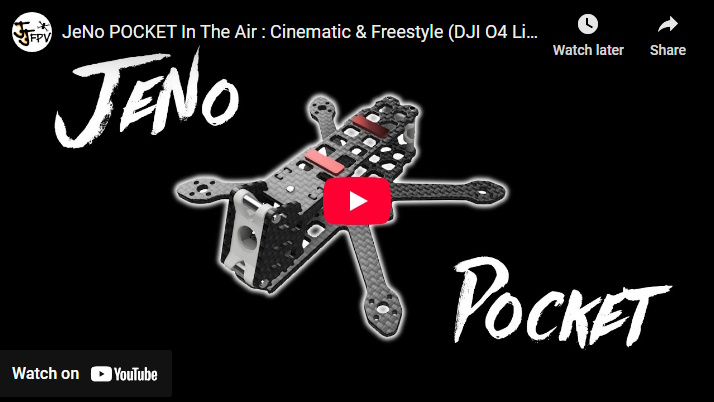

[](https://creativecommons.org/licenses/by/4.0/)
> [!NOTE]
> Current version : **1.0.0** (read [changelog](#changelog) for details)


# JeNo Pocket 2.5"
***2.5" drone FPV frame compatible with Air Unit O4 Lite (or any Nano camera), designed for Freestyle, Freeride and Cinematic.***

> [!NOTE]
> Designed in France by members of the [WE are FPV](https://www.wearefpv.fr/) community, the JeNo is already flown by hundreds of pilots and is now being sold by [Drone FPV Racer](https://www.drone-fpv-racer.com/recherche?controller=search&s=JeNo+5.1+frame&aff=64&id_campaign=13) (affiliate link). The French version of the project is available on [Printables](https://www.printables.com/model/1175339-jeno-pocket-drone-frame). Note that a [3-3.5" version](https://github.com/WE-are-FPV/JeNo-3-3.5), a [5.1-6" version](https://github.com/WE-are-FPV/JeNo-5.1) and a [7-8" version](https://github.com/WE-are-FPV/JeNo-7) of the JeNo exist.


## Table of contents

* [Key features](#key-features)
* [Presentation](#presentation)
* [Detailed specifications](#detailed-specifications)
* [Recommended configuration](#recommended-configuration)
* [Versions and files](#versions-and-files)
* [Get it cut !](#buy-it-or-cut-it-)
* [Bill of materials](#bill-of-materials)
* [Building/Assembly guide](#buildingassembly-guide)
* [Inspiration](#inspiration)
* [Tuning, Betaflight Preset](#tuning-betaflight-preset)
* [Blackbox](#blackbox)
* [Videos](#videos)
* [Builds examples](#builds-examples)
* [Authors](#authors)
* [TPU](#tpu)
* [Community (remixes and TPU)](#community-remixes-and-tpu)
* [Changelog](#changelog)

## Key features
- [x] Perfect integration of the **DJI Air Unit O4 Lite** camera
- [x] **Wide-X** geometry
- [x] Excellent **flight performance**, easy to tune
- [x] **Sturdiness** and **rigidity**
- [x] Frame, standoffs, and propellers **NOT visible in the video feed**
- [x] **Variable tilt** from 20° to 35°
- [x] Designed for : DJI AU O4 Lite, WalkSnail, HDZero, Analog
- [x] **Soft-mounted camera** for good stabilization and better durability
- [x] **Roomy** (20 mm high)
- [x] Obviously **Open Source**

## Presentation
**2.5" quads** are **amazing** : playful, lightweight, quiet. You can fly them almost anywhere without risking disturbance or injury. Plus, (almost) everything is cheaper: motors, lipos, props…

The DJI Air Unit O3 and its camera were not suitable for this format, which is why we stopped at the [JeNo 3"](https://github.com/WE-are-FPV/JeNo-3-3.5). But the release of the **Air Unit O4 Lite** changes everything !

This was the perfect opportunity to give the [JeNo 3"](https://github.com/WE-are-FPV/JeNo-3-3.5) a little brother ! And although there's only a **0.5" difference** in prop size, they are actually very different ! The JeNo Pocket looks **twice as small** and is, in fact, **twice as light** !


Of course, the Pocket retains everything that defines the **JeNo DNA** :

* Carbon camera cage
* High performance and durability
* Spacious and easy to build
* Completely unobstructed video feed (no frame or propellers in view)
* Open Source
* We've also introduced a few extra refinements. For the first time, the **tilt is adjustable** between **20°** and **35°**.


It is possible to use the camera plates to mount the O4 Lite camera using the 16 mm rail spacing, although we do not recommend this approach. Any other **Nano-format** camera should be mountable using the central rail.

The O4 Lite camera is quite sensitive to **vibrations**. For **stabilization** to work properly, it must be correctly **isolated from the frame**. It's not very noticeable, but we’ve maintained a 0.3 mm gap on each side of the mount. The key here is to ensure that the mount is not compressed between the two camera plates.

We’ve included two through-holes to enhance the **soft-mount** effect while also reducing weight. The mount weighs just 1.4 grams. No issues with **Gyroflow** under these conditions!


Although a back stack is no longer needed, we’ve still included a 13 mm x 13 mm area to accommodate an **external RX**, a buzzer, or a capacitor. A small **tab** is also provided to secure a zip tie if needed.


A small capacitor can also be attached to the front standoff (e.g., 220 µF 25V).


The JeNo is also available in [3" and 3.5" versions](https://github.com/WE-are-FPV/JeNo-3-3.5), [5.1-6" versions](https://github.com/WE-are-FPV/JeNo-5.1) and [7-8" versions](https://github.com/WE-are-FPV/JeNo-7).


## Detailed specifications

|||
| :--- | :--- |
| **Geometry** | **Wide-X** | 
| **Props size** | 2.5" | 
| **Weight** | **24 g**, with screws | 
| **Body height** | 20 mm | 
| **Bottom plate** | 3 mm | 
| **Top plate** | 2 mm | 
| **Camera plates** | 2 mm | 
| **Motors mounting** | 9 mm | 
| **Camera** | 14 mm, Nano, O4 Lite camera. **Clear FOV**. Ajustable. |
| **Main stack** | 30.5 mm x 30.5 | 
| **Back stack** | RX area. 13 mm x 13 mm | 
| **Supported VTX** | Analogic, **DJI Air Unit O4 Lite**, WalkSnail, HDZero… | 
| **Strap passage** | No | 

## Recommended configuration

Different approaches are possible, from ultra-light to mini-rocket, depending on your hardware choices.

### Motors


| **Size** | **Stator volume** | **Recommended KV (2S)** | **Recommended KV (3S)** |
| :---: | :---: | :---: | :---: |
| 1202 | 226 mm³ | ~8000 | ~6000 |
| 1103 | 285 mm³ | ~8000 | ~6000 |
| **1203** | **339 mm³** | **~8000** | **~6000** |
| **1104** | **380 mm³** | **~8000** | **~6000** |
| **1303** | **398 mm³** | **~8000** | **~6000** |
| 1204 | 452 mm³ | ~8000 | ~6000 |
| 1105 | 475 mm³ | ~8000 | ~6000 |

2S motors can also be used on 3S thanks to the **"motor limit"** feature in **Betaflight**.

### Lipos

We recommend **2S or 3S lipos** as indicated in the table above, although 4S is also an option.

**2S ~550 mAh** lipos are a good compromise, or **3S ~450 mAh**. For maximum flight time, **3S ~550 mAh** lipos are still perfectly viable.

Small 2S ~450 mAh lipos are possible with a very light setup and small motors, but the impact on flight time and sag may become noticeable.

In any case, we strongly recommend **Dogcom 2S and 3S 560 mAh** lipos, as they have shown the best performance by far.

<p align="center">
  
</p>

Depending on the lipos, during a freestyle flight outdoors in cold weather (~5°C), flight times can range from **2 minutes** (BetaFPV 2S 450 mAh) to **5 minutes** (Dogcom 3S 560 mAh)! You can even hope to reach **7 minutes** with a smooth flight using these same lipos.

### Props
We have always flown the **Avan Rush 2.5"** and are completely satisfied with them.

### FC, ESCs and RX
Here, you’ll have plenty of choices, as the range is very diverse. The main recommendation is to go for an **FC AiO** with ESCs that can deliver **20A**, to be on the safe side, although theoretically, 15A should be sufficient.

The O4 Lite can be powered **directly from the lipo** if you’re using 2S or 3S. For higher voltages, you'll need an FC with a BEC capable of delivering at least 10W for the O4.

Having experienced many unreliable AiOs that didn’t meet the advertised specifications, we recommend opting for **proven hardware**.

Choosing an FC with an **integrated RX** can be a good option to save weight. When they feature a copper antenna, the range is generally quite limited. An **external RX** will often be a better option for range.

Those equipped with a flat antenna or, even better, a ceramic antenna, will offer a good balance of range while minimizing weight gain.


The **capacitor** is generally not required for 2S and 3S builds, but if you choose to use one, a **220 µF 25V** will do the job and can be placed either at the front standoff or at the back.

As for the **XT30** pigtail, **18 AWG** cable is a good compromise.

## Versions and files

### Versioning
You will find the **current version** of the frame at the beginning of the description and the full [history of modifications](#changelog) at the end of the page.

We strongly recommend always cutting the latest version to ensure you benefit from the most recent optimizations.

The version **number format** is as follows :
```
<Major versions>.<Minor version>.<Revision>
ex : 1.3.2
```

* **Revision :** This number is incremented in the case of minor modifications with no significant impact.
* **Minor version :** This number is incremented for minor modifications that may potentially break compatibility with certain TPU parts.
* **Major version :** This number is incremented for significant modifications that break compatibility at the carbon level.

Since the creation of the JeNo 5", we have always strived to **maintain compatibility at the carbon level**. As a result, the version remains “1.x.y.”

In practical terms, this means that if you have the very first version of the JeNo 5" and want to equip it with the **O4 Pro**, you only need to have new camera plates cut—they will be compatible with your frame version!

**Note :** If you develop TPU parts for the JeNo, be sure to specify the version they are compatible with.

### Files management
To simplify things, we have reorganized the file structure. The files are now divided into **five groups** :

* **01-FRAME :** Contains **models** describing the **frame** in DXF, STEP, and STL formats for the current version. Also contains a PDF file which is a reformatted version of the DXF.
* **02-TPU :** Contains **TPU models** for the current frame version in STL format.
* **03-FRAME-HISTORY :** Contains previous versions of the frame.
* **04-TPU-HISTORY :** Contains TPU models that are no longer compatible with the current version.
* **OTHER-FILES :** Contains documentation files, including the assembly manual and a description.

The major change is that all options are now consolidated into a single file. This will make version management significantly easier for us.

If you want to view the DXF file with all annotations, we recommend using the free software [DWG TrueView](https://www.autodesk.com/products/dwg-trueview/overview). If you prefer not to use it, the PDF version of the file will contain all the necessary information.

## Get it cut !


Unlike the 3 and 5" JeNos, the JeNo Pocket won't be available in shops.

The ["01-FRAME"](https://github.com/WE-are-FPV/JeNo-Pocket/tree/main/01-FRAME) folder contains all the files you need to get it **cut**. .DXF and .STEP files are available.

## Bill of materials

In addition to the carbon fiber, you will need the following hardware to complete the assembly of the frame.

**Standoffs**

It is recommended to use 5mm diameter standoffs, especially for those that will serve as support for TPU (backpack and capacitor). Moletted spacers can still be used, but the TPU supports will need to be modified accordingly.

| Quantity | Description | Details |
| :---: | :--- | :--- |
| **3** | **M2x20mm** standoffs **(3.5 or 4 mm diameter)** | for the body |
| **2** | **M2x14mm** standoffs **(3.5 or 4 mm diameter)** | for the camera |

**Stack materials**

20mm screws will comfortably accommodate most configurations. You can use shorter screws if you prefer.
| Quantity | Description | Details |
| :---: | :--- | :--- |
| **4** | **M2x20mm** screws | for the stack |
| **8** | **M2** nylon nuts for the stack screws (4 nuts for the base, 4 nuts on top) | for the stack |


**Frame materials**

| Quantity | Description | Details |
| :---: | :--- | :--- |
| **3** | Minimum **M2x6** mm screws (titanium if possible) | for the top plate |
| **7** | **M2x5-6 mm** screws (titanium if possible) | for the bottom and camera plates |

**Additional materials**

| Quantity | Description | Details |
| :---: | :--- | :--- |
| **12-16** | **M2x5mm** screws if there is NO arm protection between the screw and the motor, otherwise, **M2x6mm**. To save **weight**, you can use only **3 screws per motor**. | for the motors |

## Building/Assembly guide

### Build
The assembly of the frame is straightforward :

<p align="center">
  
</p>

### Lipo mounting

Two spaces are provided on the top plate to attach two thin strips of **lipo pad** (approximately 16mm x 5mm). It is recommended to use 1.5mm thick lipo pad to minimize weight.

<p align="center">
  
</p>

**11-12 cm long straps** will work perfectly for 2S and 3S lipos from 450 to 560 mAh.

We also offer 3 **TPU lipo pads** and 2 custom-cut lipo pads.


* **JeNoPocket_Wrapping_LipoPad.stl** : wraps around and clips into the top plate (0.5g + 0.5g)
* **JeNoPocket_Sticking_LipoPad.stl** : to be glued to the top plate (0.7g)
* **JeNoPocket_Sticking_LipoPad_Light.stl** : to be glued to the top plate, light version (0.5g)
* **JeNoPocket_LipoPad_Cut.dxf** : template for custom lipo pad cutting
* **JeNoPocket_LipoPad_Light_Cut.dxf** : template for custom lipo pad cutting (light)

Since the JeNo Pocket and lipos are so light, using TPU lipo pads is sufficient. They can be paired with an anti-slip strap, but it's not mandatory.

The version that wraps around the top plate is a bit heavier but eliminates the need for glue.

## Inspiration

The **JeNo Pocket** is mainly inspired by its two larger siblings, the JeNo 3 and 5".

**The back stack is no longer needed** with the Air Unit O4 Lite. The front, made up of 2 camera plates, has been designed around the O4 Lite camera.

We kept a 20mm bus height to ensure a **roomy build**, maintain an aesthetic balance with the camera cage, and make sourcing standoffs easier.

## Tuning, Betaflight Preset

**No preset integrated** for now. The behavior of AiOs can vary quite a bit from one to another. We'll wait for more feedback before finalizing anything.

However, here’s an overview of the first tune used for our test flights, which you can use as a starting point if your **Blackbox** is **clean enough**. Note that we’ve activated the profile switch based on the number of cells in the lipo.

As always, be very **cautious** when applying these settings.

**PID profile for 2S :**


**PID profile for 3S (8000KV motors limited to 75%):**


**Filters :**


## Blackbox

Here’s an overview of the vibration distribution across the 3 axes for the JeNo Pocket. This is the **unfiltered** gyro signal from a tuning flight lasting over a minute:


No major spikes, and the signals are easy to filter.

## Videos
Presentation of the **JeNo Pocket** on the **WE are FPV** channel :

[](https://www.youtube.com/watch?v=WM7FAgx-Zp0 "JeNo Pocket review on WE are FPV (French) - Click to Watch!")

Demonstration of the **JeNo Pocket's capabilities** (Cinematic, Freestyle Proxy, Freestyle Open Field):

[](https://www.youtube.com/watch?v=4OGVIj1YK9c "JeNo Pocket cinematic and freestyle flights - Click to Watch!")

## Builds examples

You can find many build examples on [WE are FPV's DroneBuilds](https://forum.wearefpv.fr/71-dronebuilds/) and [RotorBuilds](https://rotorbuilds.com) :

* fr : [JeNo Pocket 2/3S 1104/1303](https://forum.wearefpv.fr/topic/24092-jeno-pocket) (by Jéjé FPV)
* fr : [JeNo Pocket 2/3S 1203)](https://forum.wearefpv.fr/topic/24204-jeno-pocket-encore/) (by Jéjé FPV)
* fr : [JeNo Pocket Naked Vista/Nebula Pro Nano](https://forum.wearefpv.fr/topic/24201-jeno-pocket-3s-vista-naked-%F0%9F%9A%80/) (by Feisar)
* fr : [JeNo Pocket](https://forum.wearefpv.fr/topic/24178-jeno-pocket-de-nic0/) (by Nic0)
* ...

Find numerous examples of builds on the _**DroneBuilds**_ page of WE are FPV.
[](https://forum.wearefpv.fr/71-dronebuilds/ "DroneBuilds - Click to Access!")

## Authors

The JeNo Pocket was designed by :

* Jerome / Jéjé FPV - [Youtube](https://www.youtube.com/@jejefpv)

## TPU

Among the files to download, you’ll find some TPU parts for your JeNo Pocket. Initially, these include only the camera/antenna mounts for 3.5 or 4 mm standoffs, as well as a few lipo pads.

## Community (remixes and TPU)

**Fork/remix**


**TPU**


## Changelog

> [!TIP]
> Compatibility is consistently maintained between each version: if your frame was a v1, the parts from v1.2 will be compatible. The same applies to TPU accessories. That's why we don't keep the history of previous versions.

* 09/03/2025 : 
  * Added lipo pads (in TPU, to be glued/inserted or custom-cut).
* 17/02/2025 : 
  * Added a few arm protections to screw or clip on, with or without pads.
* Version **1.0.0** (01/02/2025) :
  * Release of the JeNo Pocket in beta version.

## Join the JeNo family !

||
|:---:|
| JeNo Classic Modus (left), JeNo Cine (right), JeNo 6" (top), JeNo 3" (bottom) |